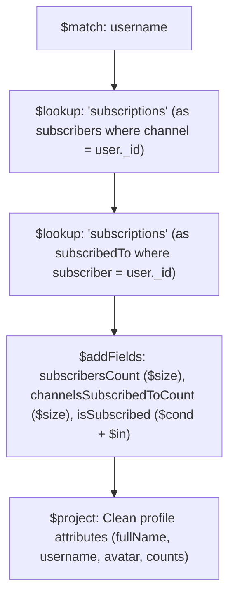
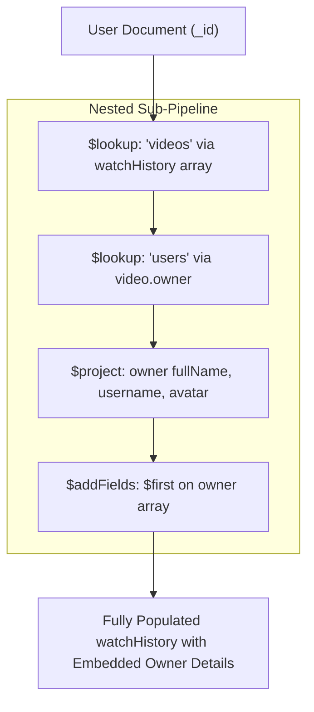

# 🚀 Production Backend Architecture, Models & Aggregation Pipelines (`Node/03_Project`)

<div align="center">

  
  &nbsp;&nbsp;&nbsp;&nbsp;
  
  &nbsp;&nbsp;&nbsp;&nbsp;
  
  &nbsp;&nbsp;&nbsp;&nbsp;
  
  &nbsp;&nbsp;&nbsp;&nbsp;
  
  &nbsp;&nbsp;&nbsp;&nbsp;
  

  <br/><br/>

  [](https://nodejs.org/)
  [](https://expressjs.com/)
  [](https://www.mongodb.com/cloud/atlas)
  [](https://mongoosejs.com/)
  [](https://www.npmjs.com/package/bcrypt)
  [](https://www.npmjs.com/package/multer)

</div>

---

> [!IMPORTANT]
> ### 🏆 MILESTONE REACHED: COMPLETE BACKEND ARCHITECTURE & DATA ENGINE
> **COMPLETED BASIC MERN WITH THIS AND THIS AND THISS !!**
>
> 🗓️ **START DATE :** `21-July-2026`  
> 🏁 **END DATE :** `06-September-2026`  
>
> 💬 *"I DIDNT END HERE | HERE I START !"*  
> *From fundamental JavaScript & React primitives to high-throughput Node.js micro-architectures, enterprise-level MongoDB aggregation pipelines, and nested sub-pipeline data joins.*

---

## 🏗️ Project Architecture & Directory Layout

```text
Node/03_Project/
├── public/
│   └── temp/                  # Temporary staging directory for multipart uploads (.gitkeep)
├── src/
│   ├── Controllers/
│   │   └── User.controller.js # Auth, Profile, Avatar/Cover, Channel & History Aggregations
│   ├── db/
│   │   └── index.js           # Modular MongoDB connection with host logging & DNS fallback
│   ├── Middlewares/
│   │   ├── auth.middleware.js # JWT verification middleware for private endpoints
│   │   └── multer.js          # Multer diskStorage middleware for local upload staging
│   ├── Models/
│   │   ├── comment.model.js   # Comment schema with mongoose-aggregate-paginate-v2
│   │   ├── like.model.js      # Polymorphic like schema (Video, Comment, Tweet)
│   │   ├── playlist.model.js  # Playlists referencing video collections and owner
│   │   ├── subscription.model.js # Channel subscriptions model (subscriber & channel)
│   │   ├── tweet.model.js     # User text broadcasts / community posts
│   │   ├── user.model.js      # User schema, bcrypt pre-save, JWT generation & instance methods
│   │   └── video.model.js     # Video schema, duration, views & aggregate-paginate-v2
│   ├── Routes/
│   │   └── User.routes.js     # User routing declarations (public & secured)
│   ├── utils/
│   │   ├── ApiError.js        # Standardized custom error class extending Error
│   │   ├── ApiResponse.js     # Uniform API response structure class
│   │   ├── asyncHandler.js    # Higher-Order async wrapper for route controllers
│   │   └── cloudinary.js      # Cloudinary SDK wrapper with local file cleanup
│   ├── app.js                 # Express application configuration & global middlewares
│   ├── constants.js           # Application constants (e.g., DB_NAME)
│   └── index.js               # Application entry point & server bootstrap
├── .env                       # Environment variables (Git-ignored)
├── .env.sample                # Sample environment template
├── .gitignore                 # Git ignore rules
├── package.json               # Project manifest and dependencies
└── README.md                  # Comprehensive documentation
```

---

## 🗄️ Complete Database Models (`src/Models/`)

The application powers a complete media-sharing ecosystem (YouTube & Twitter clone architecture) with 7 interconnected Mongoose models:

| Model | File | Primary Fields | Relationships |
| :--- | :--- | :--- | :--- |
| **User** | [`user.model.js`](file:///c:/Users/Harsh%20Rathore/Desktop/NODE/Study/MERN/Node/03_Project/src/Models/user.model.js) | `username`, `email`, `fullName`, `avatar`, `coverImage`, `password`, `refreshToken` | `watchHistory` → `[Video]` |
| **Video** | [`video.model.js`](file:///c:/Users/Harsh%20Rathore/Desktop/NODE/Study/MERN/Node/03_Project/src/Models/video.model.js) | `videoFile`, `thumbnail`, `title`, `description`, `duration`, `views`, `isPublished` | `owner` → `User` |
| **Subscription** | [`subscription.model.js`](file:///c:/Users/Harsh%20Rathore/Desktop/NODE/Study/MERN/Node/03_Project/src/Models/subscription.model.js) | `subscriber`, `channel` | `subscriber` → `User`<br/>`channel` → `User` |
| **Playlist** | [`playlist.model.js`](file:///c:/Users/Harsh%20Rathore/Desktop/NODE/Study/MERN/Node/03_Project/src/Models/playlist.model.js) | `name`, `description`, `videos` | `videos` → `[Video]`<br/>`owner` → `User` |
| **Like** | [`like.model.js`](file:///c:/Users/Harsh%20Rathore/Desktop/NODE/Study/MERN/Node/03_Project/src/Models/like.model.js) | Polymorphic targets: `video`, `comment`, `tweet`, `likedBy` | Relational references to `Video`, `Comment`, `Tweet`, `User` |
| **Tweet** | [`tweet.model.js`](file:///c:/Users/Harsh%20Rathore/Desktop/NODE/Study/MERN/Node/03_Project/src/Models/tweet.model.js) | `content`, `owner` | `owner` → `User` |
| **Comment** | [`comment.model.js`](file:///c:/Users/Harsh%20Rathore/Desktop/NODE/Study/MERN/Node/03_Project/src/Models/comment.model.js) | `content`, `video`, `owner` | `video` → `Video`<br/>`owner` → `User` *(Paginated)* |

---

## ⚡ MongoDB Aggregation & Sub-Aggregation Pipelines

Aggregation pipelines process documents through multi-stage transformations directly inside MongoDB's C++ core engine for maximum performance.

### 1. Channel Profile Aggregation (`getUserChannelProfile`)

Calculates dynamic channel metrics on the fly without storing denormalized counters:



```javascript
const channel = await User.aggregate([
    { $match: { username: username.toLowerCase().trim() } },
    {
        $lookup: {
            from: "subscriptions",
            localField: "_id",
            foreignField: "channel",
            as: "subscribers"
        }
    },
    {
        $lookup: {
            from: "subscriptions",
            localField: "_id",
            foreignField: "subscriber",
            as: "subscribedTo"
        }
    },
    {
        $addFields: {
            subscribersCount: { $size: "$subscribers" },
            channelsSubscribedToCount: { $size: "$subscribedTo" },
            isSubscribed: {
                $cond: {
                    if: { $in: [req.user?._id, "$subscribers.subscriber"] },
                    then: true,
                    else: false
                }
            }
        }
    },
    {
        $project: {
            fullName: 1,
            username: 1,
            subscribersCount: 1,
            channelsSubscribedToCount: 1,
            isSubscribed: 1,
            avatar: 1,
            coverImage: 1,
            email: 1
        }
    }
]);
```

---

### 2. Watch History with Nested Sub-Pipelines (`getWatchHistory`)

Uses a nested sub-pipeline inside `$lookup` to join videos, and a nested sub-sub-pipeline to look up and project the creator of each video in a single database roundtrip:



```javascript
const user = await User.aggregate([
    {
        $match: {
            _id: new mongoose.Types.ObjectId(req.user._id)
        }
    },
    {
        $lookup: {
            from: "videos",
            localField: "watchHistory",
            foreignField: "_id",
            as: "watchHistory",
            pipeline: [
                {
                    $lookup: {
                        from: "users",
                        localField: "owner",
                        foreignField: "_id",
                        as: "owner",
                        pipeline: [
                            {
                                $project: {
                                    fullName: 1,
                                    username: 1,
                                    avatar: 1
                                }
                            }
                        ]
                    }
                },
                {
                    $addFields: {
                        owner: { $first: "$owner" }
                    }
                }
            ]
        }
    }
]);
```

---

## 📡 Complete API Endpoints (`/api/v1/users`)

| Method | Endpoint | Auth Required | Description | Request Format |
| :--- | :--- | :---: | :--- | :--- |
| `POST` | `/register` | ❌ | Register new account with avatar & cover image | `multipart/form-data` |
| `POST` | `/login` | ❌ | Authenticate credentials & issue tokens | `application/json` |
| `POST` | `/refresh-token` | ❌ | Refresh Access & Refresh token pair | Cookie / Body |
| `POST` | `/logout` | ✅ | Clear refresh token & delete auth cookies | Headers / Cookie |
| `POST` | `/change-password` | ✅ | Validate old password and update to new password | `application/json` |
| `GET` | `/current-user` | ✅ | Fetch authenticated user's profile | Bearer Token |
| `PATCH` | `/update-account` | ✅ | Update user's `fullName` and `email` | `application/json` |
| `PATCH` | `/avatar` | ✅ | Upload new user avatar to Cloudinary & update DB | `multipart/form-data` |
| `PATCH` | `/cover-image` | ✅ | Upload new user cover image to Cloudinary & update DB | `multipart/form-data` |
| `GET` | `/c/:username` | ✅ | Aggregation: Fetch channel profile, counts & subscriber status | URL Parameter |
| `GET` | `/history` | ✅ | Sub-Pipeline: Retrieve user watch history with populated owners | Bearer Token |

---

## 🛠️ Environment Variables Configuration (`.env`)

```env
PORT=8000
MONGODB_URI=mongodb+srv://<username>:<password>@cluster0.xxxxx.mongodb.net
CORS_ORIGIN=*

ACCESS_TOKEN_SECRET=your_access_token_secret_key_here
ACCESS_TOKEN_EXPIRY=1d

REFRESH_TOKEN_SECRET=your_refresh_token_secret_key_here
REFRESH_TOKEN_EXPIRY=10d

CLOUDINARY_CLOUD_NAME=your_cloudinary_cloud_name
CLOUDINARY_API_KEY=your_cloudinary_api_key
CLOUDINARY_API_SECRET=your_cloudinary_api_secret
```

---

## 💻 Local Setup & Execution

```bash
# Navigate to directory
cd Node/03_Project

# Install dependencies
npm install

# Run development server with auto-reload (nodemon)
npm run dev
```

---

<div align="center">
  <b>I DIDNT END HERE | HERE I START !</b><br/>
  <i>Developed with precision by <a href="https://github.com/harsh-pratap-singh-rathore">Harsh Pratap Singh Rathore</a></i>
</div>
